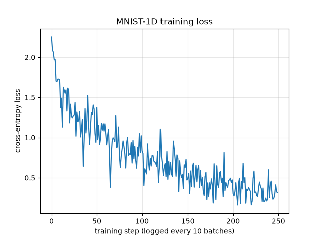

# MNIST-1D

[MNIST-1D](https://arxiv.org/abs/2011.14439v4) training Implementation through numpy.

---
You can read the implementation details [here](./Implementation-details/main.pdf). The pdf is generated via typst.